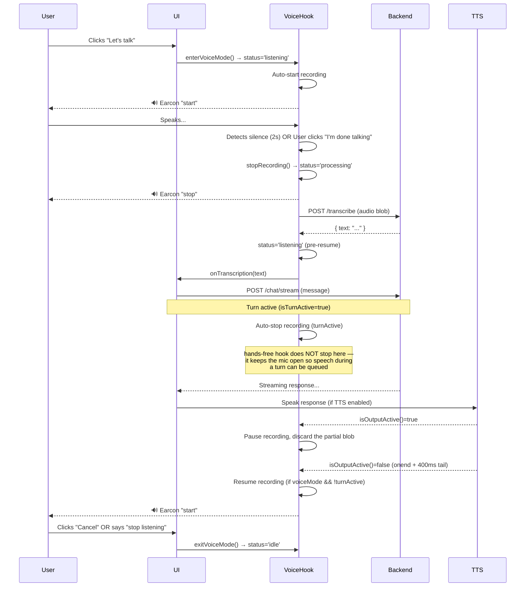

# Conversation Mode: Expected Flow of Operations

> **Purpose**: Single source of truth for the hands-free voice conversation mode behavior.
> Used for implementation, testing, and future maintenance.

---

## User Experience Flow

> This diagram is the **dictation** hook (`useVoiceRecording`, the mic button). The
> hands-free "Let's talk" flow is below, in
> [Hands-Free Conversation Mode](#hands-free-conversation-mode-useconversationvoicerecording) —
> it differs on exactly the two points marked below.



---

## State Machine

### Voice Mode States (Internal to `useVoiceRecording`)

```
┌─────────────┐
│    IDLE     │◄──────────────────────────────────┐
└──────┬──────┘                                   │
       │ enterVoiceMode()                          │ exitVoiceMode()
       ▼                                           │
┌─────────────┐     startRecording()              │
│  STARTING   │──────────────────────────────────►│
└──────┬──────┘                                   │
       │ recording started                         │
       ▼                                           │
┌─────────────┐     silence / user stop           │
│  RECORDING  │──────────────────────────────────►│
└──────┬──────┘                                   │
       │                                           │
       │ transcription                             │
       ▼                                           │
┌─────────────┐     transcription done            │
│ PROCESSING  │──────────────────────────────────►│
└──────┬──────┘                                   │
       │                                           │
       │ turnActive=true (message sent)            │
       ▼                                           │
   (blocked - no recording during turn)            │
       │                                           │
       │ turnActive=false, TTS not speaking        │
       ▼                                           │
┌─────────────┐     auto-restart                  │
│  STARTING   │──────────────────────────────────►│
└──────┬──────┘                                   │
       │                                           │
       │ TTS starts speaking                       │
       ▼                                           │
┌─────────────┐     TTS ends                      │
│ PAUSED_TTS  │──────────────────────────────────►│
└──────┬──────┘                                   │
       │                                           │
       │ user clicks "I'm done talking"            │
       ▼                                           │
┌─────────────┐     (stays here until             │
│ USER_STOPPED│      voiceMode=false)             │
└──────┬──────┘                                   │
       │                                           │
       └───────────────────────────────────────────┘
```

### Voice Status (Exposed via `voice.ts` store)

| Status | Meaning | Recording? |
|--------|---------|------------|
| `idle` | Voice mode off | No |
| `listening` | Actively recording / waiting for speech | Yes |
| `processing` | Transcribing audio | Yes — see note |
| `error` | Error state | No |

**Note**: `isTtsSpeaking` is a separate flag for browser SpeechSynthesis TTS — "the
agent is speaking" is that flag, not a `voice.status` value. `processing` overrides
`listening` in the top bar while a `/transcribe` request is outstanding, but the
microphone stays **open** through the request (only the brief recorder teardown shuts
it), so a sentence said while transcribing is queued rather than lost.

---

## Key Invariants

### 1. Recording Only When:
- `voiceMode === true` (user clicked "Let's talk")
- `turnActive === false` (not waiting for backend response)
- `isTtsSpeaking === false` (TTS not playing)
- `userInitiatedStop === false` (user hasn't clicked "I'm done talking")

### 2. Auto-Restart Conditions:
After a turn completes (assistant response fully received + TTS finished):
- Voice mode still active (`voiceMode === true`)
- No active turn (`turnActive === false`)
- TTS not speaking (`isTtsSpeaking === false`)
- User didn't explicitly stop (`userInitiatedStop === false`)

### 3. "I'm Done Talking" Button:
- **Always stops current recording immediately**
- **Sets `userInitiatedStop = true`**
- **Prevents auto-restart** until user clicks "Let's talk" again
- During TTS: stops recording, doesn't restart after TTS ends

### 4. TTS Interruption:
- If TTS starts while recording → pause recording
- If TTS ends → resume recording **only if** all auto-restart conditions met
- User can click "Stop" button during TTS to cancel speech + stay in voice mode

---

## Component Responsibilities

### `TopBar.tsx` - Voice Mode Toggle
```typescript
// "Let's talk" button
onClick={() => {
  if (voice.status !== 'idle') {
    exitVoiceMode()
    updateSetting('voiceMode', false)
  } else {
    enterVoiceMode()
    updateSetting('voiceMode', true)
  }
}}

// "I'm done talking" button (inline in status bar)
onClick={() => stopRecording()}  // Calls hook's user-stop handler

// "Cancel" button (exits voice mode entirely)
onClick={() => {
  exitVoiceMode()
  updateSetting('voiceMode', false)
}}
```

### `ChatPage.tsx` - Hook Integration
```typescript
useVoiceRecording({                    // dictation
  isVoiceMode: () => isVoiceModeActive(),  // listening OR processing
  isDictationMode: () => isDictating(),
  isTurnActive: () => isTurnActive(),
  onTranscription: handleSendMessage,
})
```

`handleSendMessage` now only enqueues and nudges the drainer; the drain effect in
`ChatPage` is the single thing that sends. The hands-free hook enqueues directly
into `messageQueue` and never calls `handleSendMessage`.

### `useVoiceRecording.ts` - Core Logic
- MediaRecorder lifecycle
- Silence detection (2s after speech)
- Audio level monitoring (80ms interval)
- Transcription API call
- State machine (see above)
- Earcon sounds

### `voice.ts` - Shared State
- `voice.status` (idle/listening/processing/error)
- `voice.isDictating` (one-shot dictation mode)
- `voice.isTtsSpeaking` (browser SpeechSynthesis)
- `registerStopRecording` / `stopRecording` (callback for TopBar)
- **the output gate** — `speakReplacing`, `cancelSpeech`, `isOutputActive`,
  `isOutputActiveNow`, `outputGeneration`

---

## Hands-Free Conversation Mode (`useConversationVoiceRecording`)

> **This is a second, separate hook** from the dictation hook documented above.
> They are not interchangeable and they do not behave identically. Everything above
> this line describes `useVoiceRecording` (the one-shot mic button). This section
> describes `useConversationVoiceRecording` (the "Let's talk" hands-free mode).

| | `useVoiceRecording` | `useConversationVoiceRecording` |
|---|---|---|
| Mode | One-shot dictation into the input | Hands-free, continuous |
| Delivery | `onTranscription` → `handleSendMessage` | `enqueue()` → drainer |
| Own state machine | yes (`VoiceModeState`) | no — one policy, see below |
| Pauses on TTS | yes (`paused_tts`) | yes, via the shared output gate |
| Stops on an active turn | yes (correct: one-shot) | **no** — that would break queueing |

### The capture policy

The mic is open when voice mode is on and the agent is not speaking, and at no other
time. That is the whole rule; every other case follows from it.

```
!voiceMode            → shut
agent speaking        → shut, and drop what was captured
recorder settling     → shut, until the blob is assembled
otherwise             → open
```

A `/transcribe` request in flight deliberately does **not** shut the mic — captures
are queued and sent serially, so a sentence said while the previous one transcribes is
heard instead of dropped. That is why the *status*, not the mic, is what shows
"Transcribing...": the two are separate facts (see the status note above).

The *policy* is not a state machine — it is the conjunction above, read directly. The
hook keeps one small display state, `state()` (`idle | recording | transcribing`), but
an earlier four-state machine (`idle` / `recording` / `transcribing` / `paused_tts`)
existed to remember "voice mode is on but we must not record"; that is not a state, and
its own copy of the rule had no TTS branch until it was caught transcribing the agent.
Reading the conditions directly removes the possibility of the states disagreeing with
them.

> **An active turn does not close the mic.** This is the whole point of the queue:
> the user talks hands-free, the agent starts working, and whatever was said in the
> meantime has to survive to be sent when the agent is free. Gating the mic on
> `!turnActive` made that impossible — the queue could only ever hold *typed*
> messages. The backend log for a real attempt showed no `/transcribe` request at
> all, because there was never a capture to transcribe.
>
> `isTurnActive()` is still read by the hook, but only for the trace log. The
> dictation hook (`useVoiceRecording`) *does* stop on a turn, and that is correct
> there: it is a one-shot push-to-talk, not a continuous listener.

### Speaking while the agent is busy

Transcribed text is enqueued regardless of turn state. The drainer refuses to send
while `isProcessing()` is true, so the message waits; the drain effect in
`ChatPage` picks it up when `isTurnActive()` goes false. No message is dropped and
none is sent out of order — the transcript shows it, the queue holds it, and it goes
out on the next free turn.

### Acoustic echo: the agent must never transcribe itself

TTS is browser `speechSynthesis`, so while the agent answers out loud the mic hears
**the agent**. The VAD is right to call that speech. If the capture is left open, the
blob is transcribed, the agent's own words are enqueued as a *user* turn, and the
queue sends them straight back with no user action — a closed loop.

Echo was tried as a *detection* problem and abandoned, deliberately. Whisper
transcribing synthetic speech does not return the source text — it returns a
topically-adjacent paraphrase. Scored against the text the audio came from, real TTS
echo measured 0.074 on word-trigram Dice and 0.000 on containment, while a real user
turn asking a near-identical question measured 0.156 and 1.000. On char-4 Dice the
ordering inverted outright: echo 0.336 against a real user turn's 0.523. **Every
lexical measure ranked genuine speech above genuine echo, so no threshold separates
them.** Detecting the leak is not a harder problem, it is the wrong one.

So the leak is made impossible instead: strict half-duplex. The microphone is open
when voice mode is on and the agent is not speaking, and at no other time. Barge-in
(talking over the agent) is **not** implemented — the stop button is the escape
hatch, which is enough for a hands-free assistant and removes the need for audio
ducking.

### The output gate (`state/voice.ts`)

One module owns the half-duplex decision, for both hooks. They previously each
implemented their own `paused_tts` state to say the same thing, and the copies had
already drifted.

| Export | Purpose |
|---|---|
| `speakReplacing(text, configure?)` | Speak, replacing anything in flight |
| `cancelSpeech()` | Stop now, hold the gate for the tail |
| `isOutputActive()` | Reactive; what the capture policy reads |
| `isOutputActiveNow()` | Imperative; also consults `speechSynthesis` |
| `outputGeneration()` | Snapshot before an await, compare after |

**One utterance in flight, newest wins.** `speechSynthesis.speak()` *queues*. When a
second answer finalized while the first was still audible, both played, and the
half-duplex window became the sum of every pending answer — unbounded, and with
message queuing on top, compounding across exchanges. `speakReplacing` cancels first,
so a superseded answer is truncated rather than queued and the window is bounded by
one message.

**Stale lifecycle events are ignored.** A cancelled utterance still fires
`onend`/`onerror`, asynchronously, and those events describe speech that is no longer
happening. Handled by the old code they landed on the same shared boolean and opened
the microphone mid-sentence. Every handler is now tagged with the output generation
and no-ops if it is not current.

**The gate closes at request time, not at `onstart`.** There is real latency between
`speak()` and the first syllable; holding the gate only from `onstart` left that
latency open.

**The gate outlives the audio.** `TAIL_HOLD_MS` (400ms) of hold after speech stops —
reopening the mic on the last syllable's reverb is how a tail gets captured. The
TopBar "Stop" button uses `cancelSpeech()` for the same reason; a bare
`speechSynthesis.cancel()` left the gate open on the cut-off syllable.

> **History:** the conversation hook had no TTS awareness at all while the dictation
> hook did, so the invariant above was true for one hook and false for the other —
> and the agent was observed answering its own playback. When changing either hook,
> check the other.

### The async gap in `startRecording`

`startRecording()` opens a microphone, which takes long enough — a permission prompt,
a cold `AudioContext` — for the agent to start answering. Two bugs lived in that gap,
in both hooks:

- **`isRecording()` is not a re-entrancy guard.** It only becomes true at the *end* of
  the function, so for the whole of the await the hook looked idle. A second call
  walked straight past the guard and opened a second microphone, which is how one
  223,995-byte blob was POSTed to `/transcribe` twice a millisecond apart. Fixed with
  `startingUp`, set synchronously before any suspension point.
- **The gate has to survive the await.** The hooks snapshot `outputGeneration()` before
  `await getUserMedia()` and compare after. A boolean read is stale the moment the
  await suspends; only a changed counter proves the speaker moved at all. A capture
  granted into a room where the agent has started talking is torn down and its track
  released.

A failed `getUserMedia` is **parked** for `CAPTURE_RETRY_MS` rather than retried on
every policy tick. Without that, a permission denial or a missing input device is an
unbounded loop that re-prompts forever — verified: an unwired stream exhausted 4GB in
145 seconds.

### Delivery

Transcribed text is `enqueue()`d with `source: 'voice'`, never sent directly. The
drainer owns `processing`; the hook must not set it, or `drainQueueIfReady()` bails
on `isProcessing()` and strands the message. A capture is submitted to `/transcribe`
at most once, and a capture abandoned for TTS is never submitted at all.

---

## Edge Cases Handled

| Scenario | Behavior |
|----------|----------|
| User clicks "Let's talk" while TTS speaking | TTS cancelled, recording starts after 100ms |
| Silence detected but < 500ms recorded | Discarded, "Didn't catch that", auto-restart |
| Transcription returns empty | Discarded, "Didn't catch that", auto-restart |
| User says "stop listening" | `exitVoiceMode()`, no auto-restart |
| Network error on transcription | Error earcon, retry after 1.2s |
| Browser denies microphone | Error earcon, exit voice mode |
| User switches conversation | Voice mode exits (cleanup in hook) |
| Page unload while recording | Cleanup stops recorder, releases mic |

---

## Timing Constants

```typescript
const SILENCE_DURATION = 2000      // Ms of silence before auto-stop
const MIN_RECORDING_MS = 500       // Minimum recording length
const MIN_AUDIO_FRAMES = 3         // Min loud frames before silence detection works
const MAX_RECORDING_MS = 180000    // Hard limit (3 minutes)
const MONITOR_INTERVAL_MS = 80     // Audio level check interval
const CAPTURE_RETRY_MS = 2000      // Ms to wait after the mic fails to open, before one retry
const TAIL_HOLD_MS = 400           // Ms the output gate stays shut after speech stops
```

> **Removed:** `TTS_RESUME_DELAY` and `RETRY_DELAY`. The resume delay existed for a
> hand-rolled `paused_tts` resume path; the capture policy now reopens the mic from
> the conditions themselves, and the retry delay is `CAPTURE_RETRY_MS`.

> **Removed:** `MIN_AUDIO_LEVEL = 0.015`. That was a fixed threshold on the mean of
> `getByteFrequencyData`, which is not an amplitude measurement. Over a 1262-frame
> capture it read 73.5% of *silent* frames as loud, and the gap between the noise
> ceiling and the quietest speech frame was 0.41 dB against a 0.275 dB quantization
> step — untunable at any value. Replaced by `src/services/voiceActivity.ts`
> (`VoiceActivityDetector`), which thresholds time-domain RMS against a tracked
> noise floor: `max(ABSOLUTE_NOISE_FLOOR, floor * NOISE_FLOOR_MULTIPLIER)`.

---

## Testing Checklist

### Unit Tests (`useVoiceRecording`)
- [ ] Auto-start on `enterVoiceMode()`
- [ ] Stop on `exitVoiceMode()`
- [ ] Stop on `turnActive=true`
- [ ] Pause on TTS start, resume on TTS end
- [ ] Silence detection triggers stop
- [ ] "I'm done talking" sets `userInitiatedStop`, prevents restart
- [ ] Transcription error → retry
- [ ] Empty transcription → discard + retry
- [ ] Exit command ("stop listening") → `exitVoiceMode()`

### Integration Tests (`ChatPage`)
- [ ] Full cycle: speak → transcribe → send → response → TTS → resume
- [ ] Queue messages while turn active
- [ ] Switch conversation exits voice mode
- [ ] Settings: TTS toggle, sound effects toggle

### E2E Tests
- [ ] "Let's talk" → speak → "I'm done talking" → response heard → auto-resume
- [ ] "Let's talk" → TTS plays → click "Stop" (TTS) → voice mode continues
- [ ] "Let's talk" → speak → "Cancel" → voice mode exits

---

## Related Files

| File | Role |
|------|------|
| `frontend/src/hooks/useVoiceRecording.ts` | Dictation: core recording/transcription logic |
| `frontend/src/hooks/useConversationVoiceRecording.ts` | **Hands-free mode**: capture policy, enqueue |
| `frontend/src/services/voiceActivity.ts` | Adaptive RMS voice-activity detection + noise floor |
| `frontend/src/state/voice.ts` | Shared voice state store **and the output gate** |
| `frontend/src/state/voiceOutputGate.test.ts` | Output gate regression tests |
| `frontend/src/components/chat/ChatPage.tsx` | Hook consumer, TTS integration, drain effect |
| `frontend/src/components/ui/TopBar.tsx` | Voice mode UI controls |
| `frontend/src/components/chat/VoiceControls.tsx` | Dictation mic button (separate from conversation mode) |
| `frontend/src/state/chat.ts` | `isTurnActive` signal |
| `frontend/src/state/messageQueue.ts` | Queue store the hook enqueues into |
| `frontend/src/services/queueDrainer.ts` | Sends queued messages when the agent is free |
| `frontend/src/services/api.ts` | `/transcribe` endpoint |

---

## Future Enhancements

1. **Barge-in**: Allow user to interrupt TTS by speaking (requires audio ducking/mixing).
   Currently the mic is hard-closed during TTS, so the agent cannot be interrupted.
2. **Wake word**: "Hey Assistant" to enter voice mode hands-free
3. **Visual feedback**: Real-time audio waveform in status bar
4. **Multi-turn context**: Keep voice mode active across multiple exchanges without "I'm done talking"

> **Done:** VAD. `src/services/voiceActivity.ts` replaced the fixed audio-level
> threshold with an adaptive time-domain RMS detector.

---

*Last updated: 2026-09-25*
*Review with any changes to conversation mode behavior*