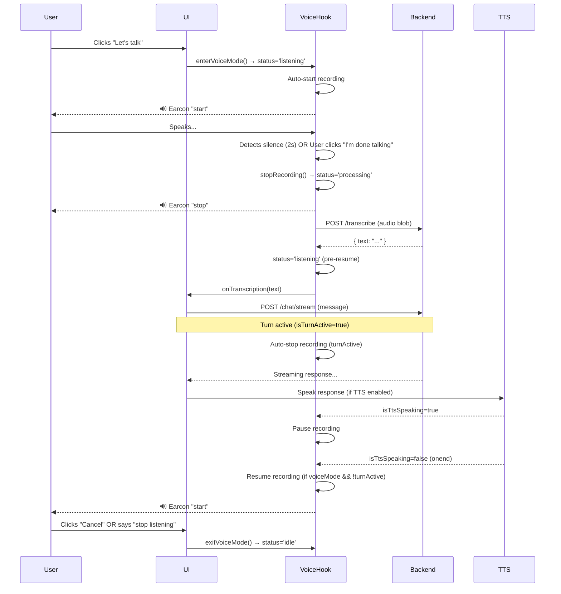

# Conversation Mode: Expected Flow of Operations

> **Purpose**: Single source of truth for the hands-free voice conversation mode behavior.
> Used for implementation, testing, and future maintenance.

---

## User Experience Flow



---

## State Machine

### Voice Mode States (Internal to `useVoiceRecording`)

```
┌─────────────┐
│    IDLE     │◄──────────────────────────────────┐
└──────┬──────┘                                   │
       │ enterVoiceMode()                          │ exitVoiceMode()
       ▼                                           │
┌─────────────┐     startRecording()              │
│  STARTING   │──────────────────────────────────►│
└──────┬──────┘                                   │
       │ recording started                         │
       ▼                                           │
┌─────────────┐     silence / user stop           │
│  RECORDING  │──────────────────────────────────►│
└──────┬──────┘                                   │
       │                                           │
       │ transcription                             │
       ▼                                           │
┌─────────────┐     transcription done            │
│ PROCESSING  │──────────────────────────────────►│
└──────┬──────┘                                   │
       │                                           │
       │ turnActive=true (message sent)            │
       ▼                                           │
   (blocked - no recording during turn)            │
       │                                           │
       │ turnActive=false, TTS not speaking        │
       ▼                                           │
┌─────────────┐     auto-restart                  │
│  STARTING   │──────────────────────────────────►│
└──────┬──────┘                                   │
       │                                           │
       │ TTS starts speaking                       │
       ▼                                           │
┌─────────────┐     TTS ends                      │
│ PAUSED_TTS  │──────────────────────────────────►│
└──────┬──────┘                                   │
       │                                           │
       │ user clicks "I'm done talking"            │
       ▼                                           │
┌─────────────┐     (stays here until             │
│ USER_STOPPED│      voiceMode=false)             │
└──────┬──────┘                                   │
       │                                           │
       └───────────────────────────────────────────┘
```

### Voice Status (Exposed via `voice.ts` store)

| Status | Meaning | Recording? |
|--------|---------|------------|
| `idle` | Voice mode off | No |
| `listening` | Actively recording / waiting for speech | Yes |
| `processing` | Transcribing audio | No |
| `speaking` | Agent speaking (voice mode TTS) | No |
| `error` | Error state | No |

**Note**: `isTtsSpeaking` is a separate flag for browser SpeechSynthesis TTS.

---

## Key Invariants

### 1. Recording Only When:
- `voiceMode === true` (user clicked "Let's talk")
- `turnActive === false` (not waiting for backend response)
- `isTtsSpeaking === false` (TTS not playing)
- `userInitiatedStop === false` (user hasn't clicked "I'm done talking")

### 2. Auto-Restart Conditions:
After a turn completes (assistant response fully received + TTS finished):
- Voice mode still active (`voiceMode === true`)
- No active turn (`turnActive === false`)
- TTS not speaking (`isTtsSpeaking === false`)
- User didn't explicitly stop (`userInitiatedStop === false`)

### 3. "I'm Done Talking" Button:
- **Always stops current recording immediately**
- **Sets `userInitiatedStop = true`**
- **Prevents auto-restart** until user clicks "Let's talk" again
- During TTS: stops recording, doesn't restart after TTS ends

### 4. TTS Interruption:
- If TTS starts while recording → pause recording
- If TTS ends → resume recording **only if** all auto-restart conditions met
- User can click "Stop" button during TTS to cancel speech + stay in voice mode

---

## Component Responsibilities

### `TopBar.tsx` - Voice Mode Toggle
```typescript
// "Let's talk" button
onClick={() => {
  if (voice.status !== 'idle') {
    exitVoiceMode()
    updateSetting('voiceMode', false)
  } else {
    enterVoiceMode()
    updateSetting('voiceMode', true)
  }
}}

// "I'm done talking" button (inline in status bar)
onClick={() => stopRecording()}  // Calls hook's user-stop handler

// "Cancel" button (exits voice mode entirely)
onClick={() => {
  exitVoiceMode()
  updateSetting('voiceMode', false)
}}
```

### `ChatPage.tsx` - Hook Integration
```typescript
useVoiceRecording({                    // dictation
  isVoiceMode: () => isVoiceModeActive(),  // listening OR processing
  isDictationMode: () => isDictating(),
  isTurnActive: () => isTurnActive(),
  onTranscription: handleSendMessage,
})
```

`handleSendMessage` now only enqueues and nudges the drainer; the drain effect in
`ChatPage` is the single thing that sends. The hands-free hook enqueues directly
into `messageQueue` and never calls `handleSendMessage`.

### `useVoiceRecording.ts` - Core Logic
- MediaRecorder lifecycle
- Silence detection (2s after speech)
- Audio level monitoring (80ms interval)
- Transcription API call
- State machine (see above)
- Earcon sounds

### `voice.ts` - Shared State
- `voice.status` (idle/listening/processing/speaking/error)
- `voice.isDictating` (one-shot dictation mode)
- `voice.isTtsSpeaking` (browser SpeechSynthesis)
- `registerStopRecording` / `stopRecording` (callback for TopBar)

---

## Hands-Free Conversation Mode (`useConversationVoiceRecording`)

> **This is a second, separate hook** from the dictation hook documented above.
> They are not interchangeable and they do not behave identically. Everything above
> this line describes `useVoiceRecording` (the one-shot mic button). This section
> describes `useConversationVoiceRecording` (the "Let's talk" hands-free mode).

| | `useVoiceRecording` | `useConversationVoiceRecording` |
|---|---|---|
| Mode | One-shot dictation into the input | Hands-free, continuous |
| Delivery | `onTranscription` → `handleSendMessage` | `enqueue()` → drainer |
| Own state machine | yes (`VoiceModeState`) | yes (`ConvVoiceState`) |
| Pauses on TTS | yes (`paused_tts`) | yes (`paused_tts`) |

### `ConvVoiceState`

```
idle ──(voiceMode && !turnActive && !tts)──> recording
recording ──(!voiceMode || turnActive)────> idle
recording ──(tts)─────────────────────────> paused_tts   [mic closed, audio discarded]
paused_tts ──(!tts && voiceMode)─────────> recording
paused_tts ──(!voiceMode || turnActive)──> idle
transcribing ──(turnActive)──────────────> (wait for the turn to finish)
transcribing ──(tts)────────────────────> paused_tts
transcribing ──(ready && !tts)──────────> recording
```

### Acoustic echo: the agent must never transcribe itself

TTS is browser `speechSynthesis`, so while the agent answers out loud the mic hears
**the agent**. The VAD is right to call that speech. If the capture is left open, the
blob is transcribed, the agent's own words are enqueued as a *user* turn, and the
queue sends them straight back with no user action — a closed loop.

This is why `tts` is read in the state machine on every tick, alongside `voiceMode`
and `turnActive`:

- TTS playing → never open the mic (`idle`/`transcribing` go to `paused_tts`).
- TTS starts mid-recording → close the mic **and discard the partial blob**. That
  audio is mostly the agent's voice; transcribing it is the bug, not a recovery.
- TTS ends → reopen, if the other conditions hold.

Half-duplex by design. Barge-in (talking over the agent) is **not** implemented and
would need audio ducking, not just a VAD change.

> **History:** this was broken. The conversation hook had no TTS awareness at all
> while the dictation hook did, so the invariant above was true for one hook and
> false for the other — and the agent was observed answering its own playback.
> When changing either hook, check the other.

### Delivery

Transcribed text is `enqueue()`d with `source: 'voice'`, never sent directly. The
drainer owns `processing`; the hook must not set it, or `drainQueueIfReady()` bails
on `isProcessing()` and strands the message. A capture is submitted to `/transcribe`
at most once, and a capture abandoned for TTS is never submitted at all.

---

## Edge Cases Handled

| Scenario | Behavior |
|----------|----------|
| User clicks "Let's talk" while TTS speaking | TTS cancelled, recording starts after 100ms |
| Silence detected but < 500ms recorded | Discarded, "Didn't catch that", auto-restart |
| Transcription returns empty | Discarded, "Didn't catch that", auto-restart |
| User says "stop listening" | `exitVoiceMode()`, no auto-restart |
| Network error on transcription | Error earcon, retry after 1.2s |
| Browser denies microphone | Error earcon, exit voice mode |
| User switches conversation | Voice mode exits (cleanup in hook) |
| Page unload while recording | Cleanup stops recorder, releases mic |

---

## Timing Constants

```typescript
const SILENCE_DURATION = 2000      // Ms of silence before auto-stop
const MIN_RECORDING_MS = 500       // Minimum recording length
const MIN_AUDIO_FRAMES = 3         // Min loud frames before silence detection works
const MAX_RECORDING_MS = 180000    // Hard limit (3 minutes)
const MONITOR_INTERVAL_MS = 80     // Audio level check interval
const TTS_RESUME_DELAY = 100       // Ms to wait after TTS ends before restart
const RETRY_DELAY = 1200           // Ms before retry after error/discard
```

> **Removed:** `MIN_AUDIO_LEVEL = 0.015`. That was a fixed threshold on the mean of
> `getByteFrequencyData`, which is not an amplitude measurement. Over a 1262-frame
> capture it read 73.5% of *silent* frames as loud, and the gap between the noise
> ceiling and the quietest speech frame was 0.41 dB against a 0.275 dB quantization
> step — untunable at any value. Replaced by `src/services/voiceActivity.ts`
> (`VoiceActivityDetector`), which thresholds time-domain RMS against a tracked
> noise floor: `max(ABSOLUTE_NOISE_FLOOR, floor * NOISE_FLOOR_MULTIPLIER)`.

---

## Testing Checklist

### Unit Tests (`useVoiceRecording`)
- [ ] Auto-start on `enterVoiceMode()`
- [ ] Stop on `exitVoiceMode()`
- [ ] Stop on `turnActive=true`
- [ ] Pause on TTS start, resume on TTS end
- [ ] Silence detection triggers stop
- [ ] "I'm done talking" sets `userInitiatedStop`, prevents restart
- [ ] Transcription error → retry
- [ ] Empty transcription → discard + retry
- [ ] Exit command ("stop listening") → `exitVoiceMode()`

### Integration Tests (`ChatPage`)
- [ ] Full cycle: speak → transcribe → send → response → TTS → resume
- [ ] Queue messages while turn active
- [ ] Switch conversation exits voice mode
- [ ] Settings: TTS toggle, sound effects toggle

### E2E Tests
- [ ] "Let's talk" → speak → "I'm done talking" → response heard → auto-resume
- [ ] "Let's talk" → TTS plays → click "Stop" (TTS) → voice mode continues
- [ ] "Let's talk" → speak → "Cancel" → voice mode exits

---

## Related Files

| File | Role |
|------|------|
| `frontend/src/hooks/useVoiceRecording.ts` | Dictation: core recording/transcription logic |
| `frontend/src/hooks/useConversationVoiceRecording.ts` | **Hands-free mode**: recording, TTS gating, enqueue |
| `frontend/src/services/voiceActivity.ts` | Adaptive RMS voice-activity detection + noise floor |
| `frontend/src/state/voice.ts` | Shared voice state store (`isTtsSpeaking` lives here) |
| `frontend/src/components/chat/ChatPage.tsx` | Hook consumer, TTS integration, drain effect |
| `frontend/src/components/ui/TopBar.tsx` | Voice mode UI controls |
| `frontend/src/components/chat/VoiceControls.tsx` | Dictation mic button (separate from conversation mode) |
| `frontend/src/state/chat.ts` | `isTurnActive` signal |
| `frontend/src/state/messageQueue.ts` | Queue store the hook enqueues into |
| `frontend/src/services/queueDrainer.ts` | Sends queued messages when the agent is free |
| `frontend/src/services/api.ts` | `/transcribe` endpoint |

---

## Future Enhancements

1. **Barge-in**: Allow user to interrupt TTS by speaking (requires audio ducking/mixing).
   Currently the mic is hard-closed during TTS, so the agent cannot be interrupted.
2. **Wake word**: "Hey Assistant" to enter voice mode hands-free
3. **Visual feedback**: Real-time audio waveform in status bar
4. **Multi-turn context**: Keep voice mode active across multiple exchanges without "I'm done talking"

> **Done:** VAD. `src/services/voiceActivity.ts` replaced the fixed audio-level
> threshold with an adaptive time-domain RMS detector.

---

*Last updated: 2026-09-25*
*Review with any changes to conversation mode behavior*